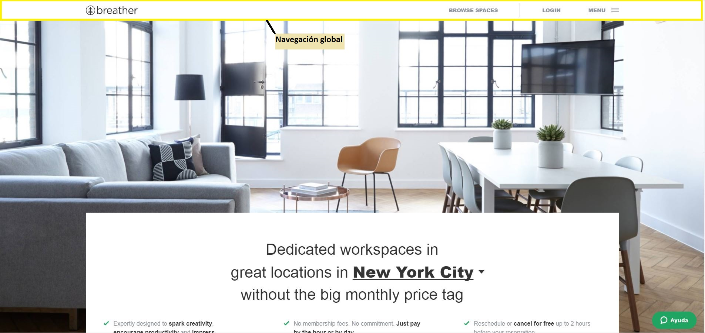
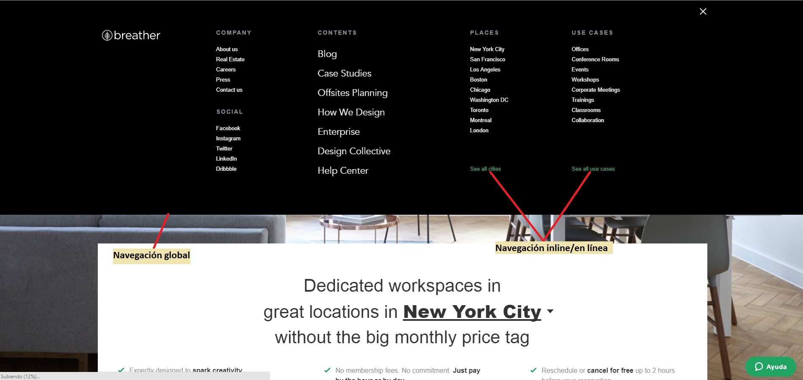
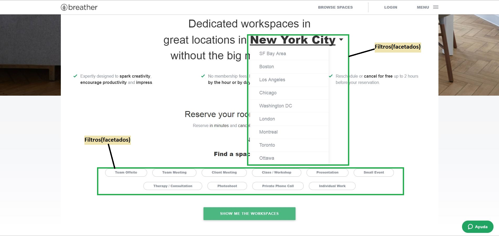
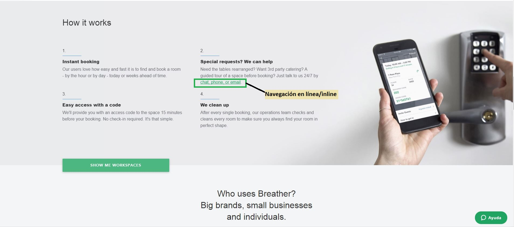
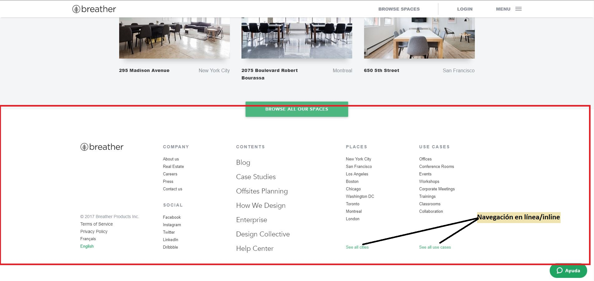
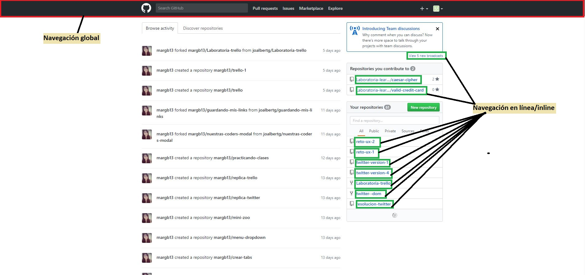
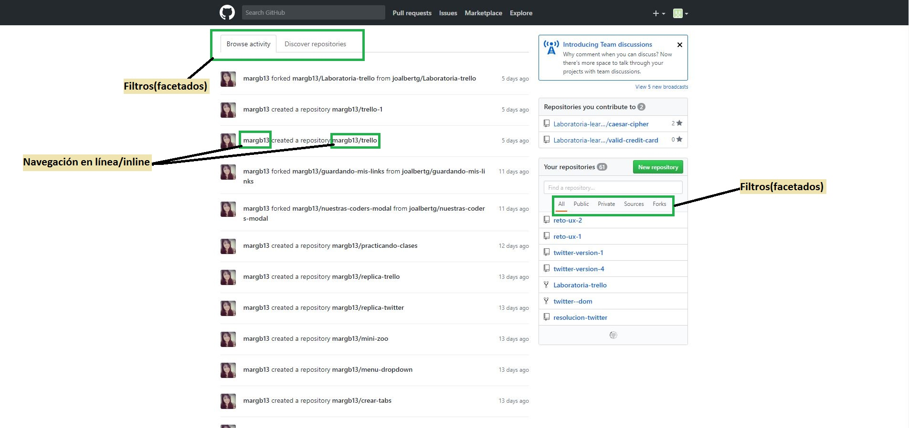
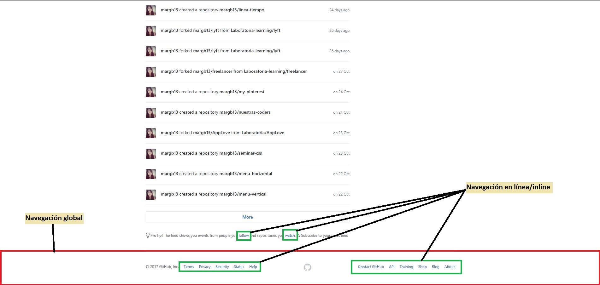
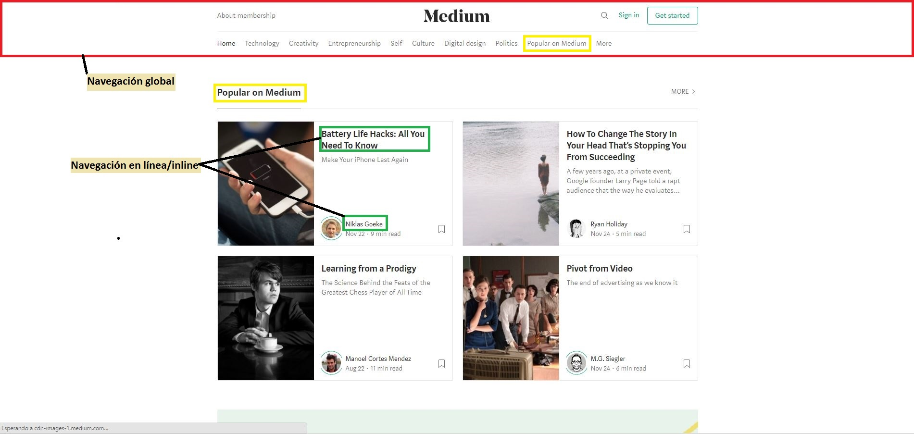
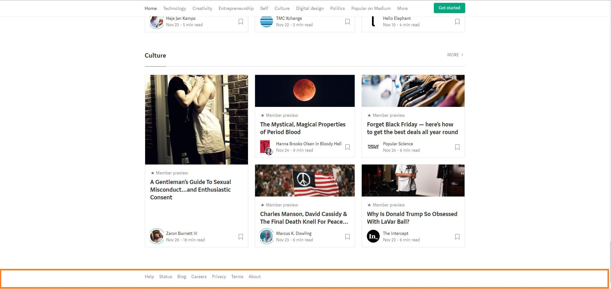

# **Reto UX nº2 | Identificando los Elementos de Navegación**

## **Objetivo**

El objetivo de este reto es identificar los elementos de navegación de los siguientes sites:

* Breather

* Github

* Medium

## **Websites**

### **Website #1 | Breather**

* Aquí se puede apreciar un elemento de navegación de tipo global. Se puede afirmar esto, ya que es persistente en todas las páginas del website.

* Al hacer clic a Menú nos devuelve un elemento de navegación de tipo global con varias opciones de navegación.
* Asimismo, también se presentan dos elementos de navegación en línea, los cuales son links de referencia.

* Los elementos de navegación de esta imagen son de tipo facetado(navegación facetada), ya que dan al usuario filtros predefinidos. No es como la navegación filtrada, en donde se puede seleccionar cuántos filtros quieras. Solo se puede seleccionar uno opción en cada uno.

* En este caso, consideré al footer como elemento de navegación ya que muestra opciones de navegación. No se le considera elemento de navegación local porque si bien solo aparece en esa página, no permite navegar dentro de esa página. Cabe resaltar, que las opciones de navegación del footer aparecen en el elemento de navegación global de la imagen 2:

### **Website #2 | Github**

* En esta imagen se muestra este encabezado que es un elemento de navegación global(aparece en todas las páginas de Github) y varios elementos de navegación inline.

* Aparte de los elementos de navegación de tipo inline, también hay de tipo facetado(navegación facetada), ya que dan al usuario filtros predefinidos.

* Aquí se muestra este elemento de navegación global, el cual es un footer. Este contiene varios elementos de navegación en línea.

### **Website #3 | Medium**

* En esta imagen se muestra este encabezado que es un elemento de navegación global. También algunos elementos de navegación inline, y por ende, son links de referencia(el subrayado aparece si les pasas el mouse por encima); y elementos de navegación que me permiten acceder a la sección que indican sin necesidad de utilizar el encabezado.

* Considero a este footer un elemento de navegación, ya que me muestra opciones de navegación. No lo considero un elemento de navegación local, porque sus opciones me dirigen a otras páginas y no dentro de esa sección.